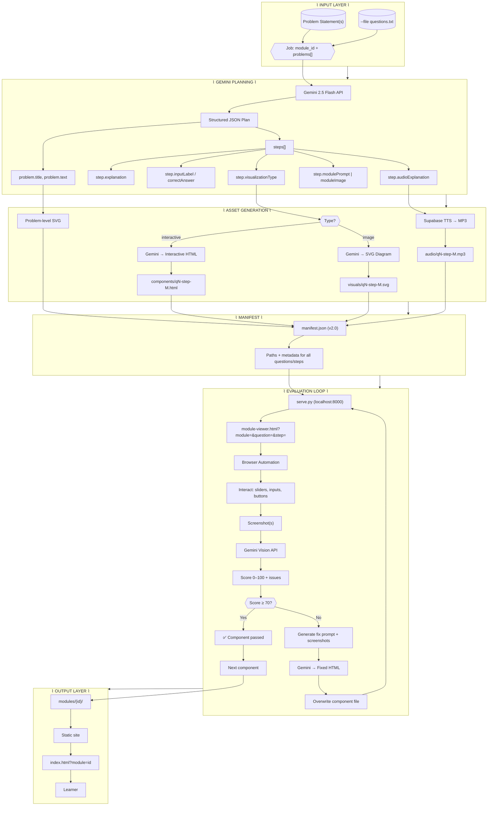
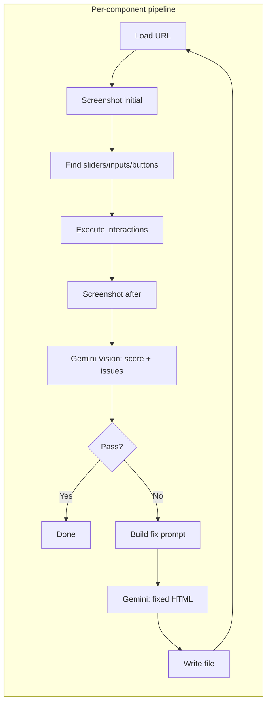
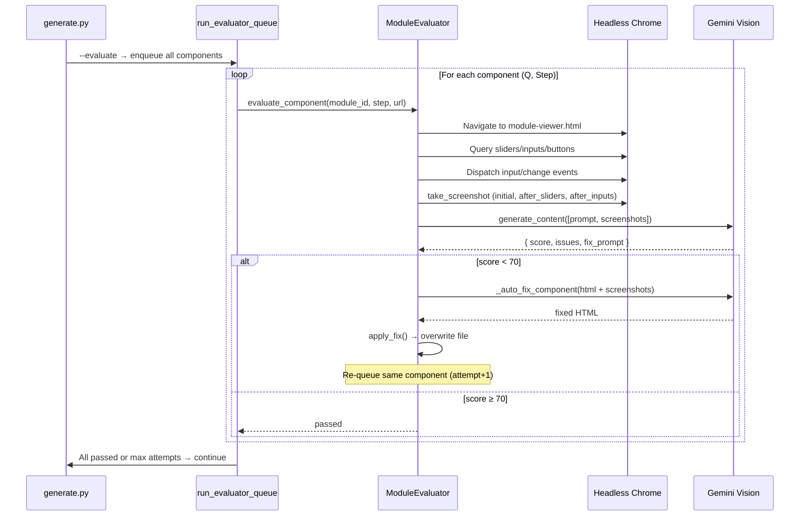
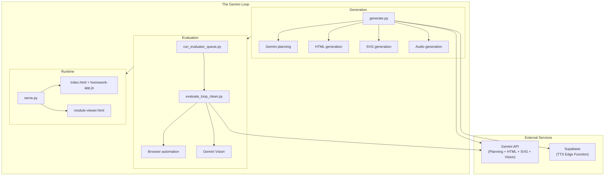

# The Gemini Loop

**AI-powered interactive homework modules with closed-loop quality assurance.**

Generate step-by-step study modules from any problem statement. The system plans with Gemini, produces interactive HTML + SVG + audio, then **validates every component in a real browser** and **auto-fixes failures** until the module is production-ready. Zero runtime AI—everything is pre-generated and tested.

---

## Architecture Overview



---

## Evaluation Loop (Detail)

The quality gate runs **inside a real browser**. Each interactive component is loaded, exercised, and scored by Gemini Vision. Failures trigger an AI fix and retest; the loop continues until the component passes or max attempts are reached.





---

## System Context (High-Level)



---

## Quick Start

### 1. Generate a module (with evaluation)

```bash
python3 generate.py "Your problem here" --id module-name --evaluate
```

Example:

```bash
python3 generate.py "Solve for x: 2x + 5 = 13" --id algebra-001 --evaluate
```

The pipeline will:

- Call Gemini to produce a structured plan (steps, explanations, visualization types).
- Generate interactive HTML components and/or SVG diagrams per step.
- Optionally generate TTS audio via Supabase.
- Run the evaluation loop: load each component in a browser, interact, screenshot, score with Gemini Vision, and auto-fix failures until pass or max attempts.
- Write the final bundle to `modules/<module_id>/`.

### 2. Serve and view

```bash
python3 serve.py
```

Open:

- Single module: `http://localhost:8000/index.html?module=algebra-001`
- Multiple modules: `http://localhost:8000/index.html?modules=algebra-001,calculus-002`

---

## Repository layout

```
├── generate.py              # Entry point: Gemini planning + asset generation
├── run_evaluator_queue.py   # Queue-based evaluator (--evaluate)
├── evaluate_loop_clean.py   # Browser automation + Gemini Vision scoring + fix
├── serve.py                 # Local HTTP server for modules + module-viewer
├── index.html               # Main learner UI (loads manifest, embeds components)
├── module-viewer.html       # Isolated single-component view (used by evaluator)
├── homework-app.js          # App logic: loading, navigation, step validation
├── homework-styles.css       # Styles
├── docs/                    # Additional documentation
└── modules/
    └── <module_id>/
        ├── manifest.json    # v2.0: questions[], steps[], paths
        ├── problem-viz-qN.svg
        ├── components/      # qN-step-M.html (interactive)
        ├── visuals/         # qN-step-M.svg (static diagrams)
        └── audio/           # qN-step-M.mp3 (optional)
```

---

## Features

| Feature | Description |
|--------|-------------|
| **Multi-question modules** | One manifest, many questions; each question has multiple steps. |
| **Dual visualization** | Per step: `interactive` (HTML + sliders/graphs) or `image` (SVG). |
| **Closed-loop QA** | Browser automation + Gemini Vision scores each component; failures are fixed and re-tested. |
| **Static output** | No runtime AI; manifest + assets are pre-generated and served as static files. |
| **Math** | LaTeX in content; MathJax in the learner UI. |
| **Audio** | Optional TTS per step via Supabase. |

---

## Configuration

- **Gemini**: Set `GEMINI_API_KEY` (and optionally the API URL) in `generate.py` and in the evaluator (e.g. from `index.html` meta or env).
- **TTS**: Set `SUPABASE_URL` and `SUPABASE_KEY` in `generate.py` for audio.
- **Evaluation**: Requires a browser (Chrome/Chromium) and, if used, the BrowserUse MCP client for automation.

---

## Examples

```bash
# Algebra
python3 generate.py "Solve 3x - 7 = 14" --id algebra-002 --evaluate

# Calculus
python3 generate.py "Find the derivative of x^2 + 3x + 5" --id calculus-001 --evaluate

# Multi-part physics
python3 generate.py "A 2.5 kg block on a 30° incline connected to a 1.5 kg hanging mass via a pulley. Find (a) acceleration, (b) tension, (c) time to fall 3 m" --id physics-001 --evaluate

# Multiple problems (inline or from file)
python3 generate.py "Q1 text" "Q2 text" "Q3 text" --id my-module --evaluate
python3 generate.py --file questions.txt --id my-module --evaluate
```

---

## RunPod CPU endpoint

Build from this repo in RunPod with:

- **Branch:** `main`
- **Dockerfile Path:** `Dockerfile`
- **Build Context:** `.`

See [docs/RUNPOD.md](./docs/RUNPOD.md) for request format, env vars, and response shape.

---

## Docs

- [Architecture and flow](./docs/ARCHITECTURE.md) — diagrams and pipeline details.
- [Evaluation pipeline](./docs/EVALUATION.md) — how the evaluator and fix loop work.
- [Integration (Supabase / RunPod)](./docs/INTEGRATION.md) — tying The Gemini Loop into your backend and deployment.
- [RunPod deployment](./docs/RUNPOD.md) — GitHub config, env vars, request/response.

---

## License

See [LICENSE](./LICENSE) in this repository.
