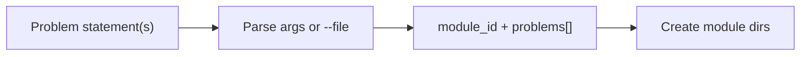
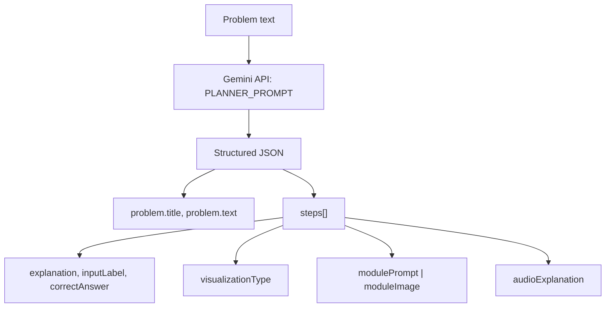
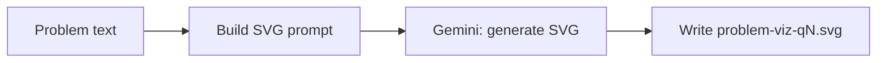
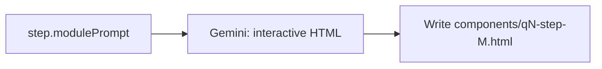
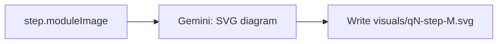
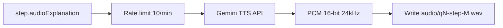
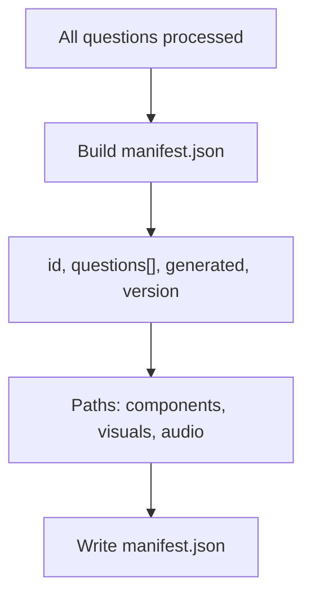
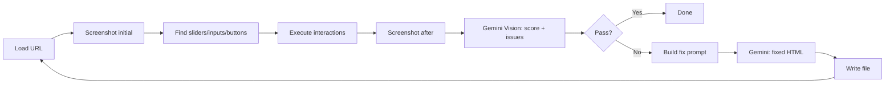
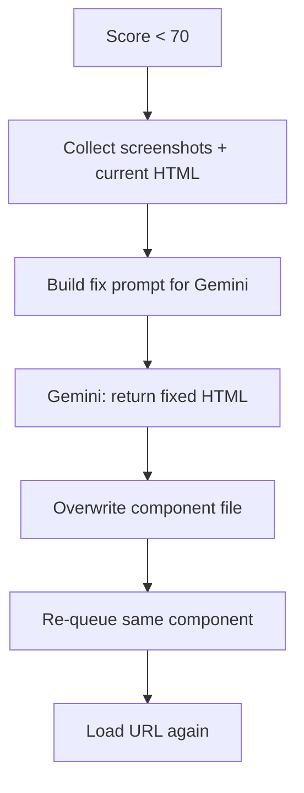
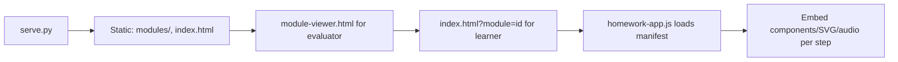

# Feature Pipelines

One flowchart per feature. Same style as the per-component evaluation pipeline: linear steps, single decision where needed, no extra detail.

---

## Input and job

---

## Gemini planning

---

## Problem-level SVG

---

## Step: interactive HTML

---

## Step: image (SVG diagram)

---

## Step: TTS audio

---

## Manifest build

---

## Per-component evaluation (quality gate)

---

## Auto-fix loop

---

## Serve and viewer

